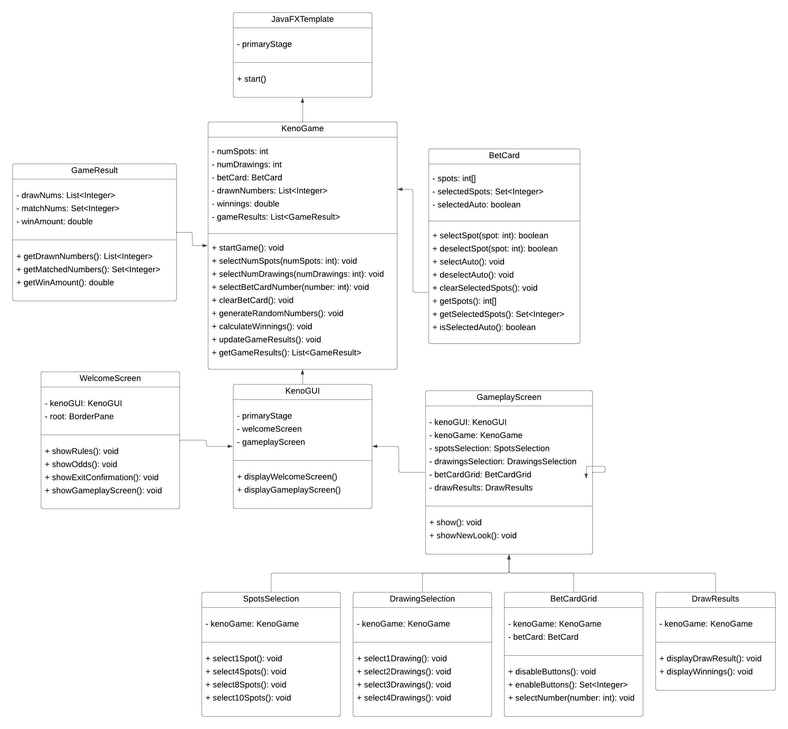
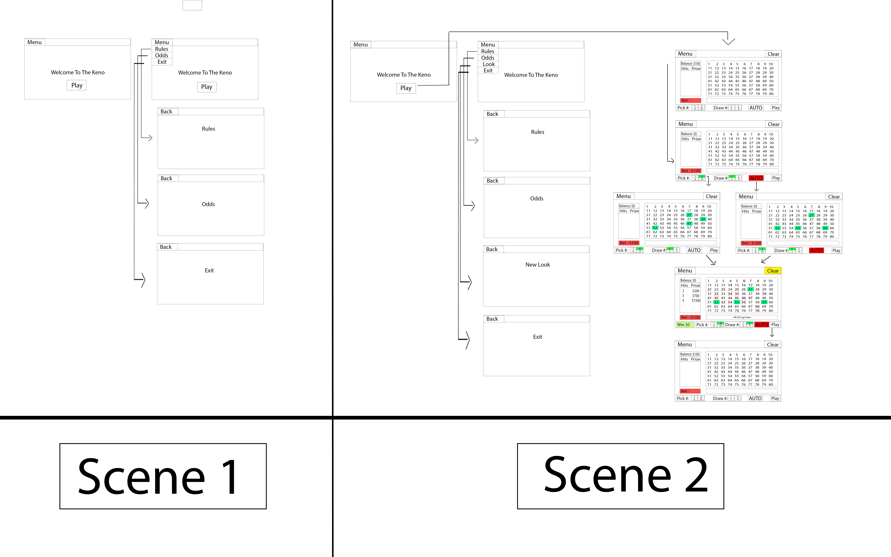

# Keno Game

This is an implementation of the popular casino and state lottery game, Keno. It has been developed using Java and features JavaFX for the GUI components. Maven handles the project's build and dependency management.

## How to Play

Keno involves players making wagers by selecting numbers ranging from 1 to 80. Once selections are made, twenty unique numbers are drawn randomly between 1 and 80. Players win based on how many of their selected numbers match the drawn numbers.

In our version:
- A single player gets to play by filling out a bet card, indicating their chosen spots.
- Players choose the number of drawings they wish to play their bet card for.
- Optionally, the game can auto-select numbers for the player.
- After each draw, players are informed about the numbers they matched, the specific numbers, and their winnings for that drawing.
- Cumulative winnings since the program's start are displayed.
- Once all chosen drawings are done, players can either start a new game or exit.

## Installation and Usage

1. Clone the repository:
```
git clone https://github.com/seyfal/JavaFX_Keno.git
```
2. Open in your favorite Java IDE (Eclipse, IntelliJ, etc.).
3. Build with Maven:
```
mvn clean package
```
4. Execute the game:
```
java -jar target/keno-game-1.0-SNAPSHOT-jar-with-dependencies.jar
```

## Dependencies

Ensure you have the following set up:

- Java (Version 8 or higher)
- JavaFX (Version 8 or higher)
- Maven (Version 3 or higher)

## Diagrams

**Class Diagram**:



View detailed [descriptions of the Class Diagram](./UML.MD).

**Keno Game Drawing**:



## Testing

JUnit 5 test cases are bundled for testing game logic. Execute them using:
```
mvn test
```

## Credits

This Keno Game was crafted by Seyfal Sultanov as a part of the CS 342 course at the University of Illinois at Chicago.
